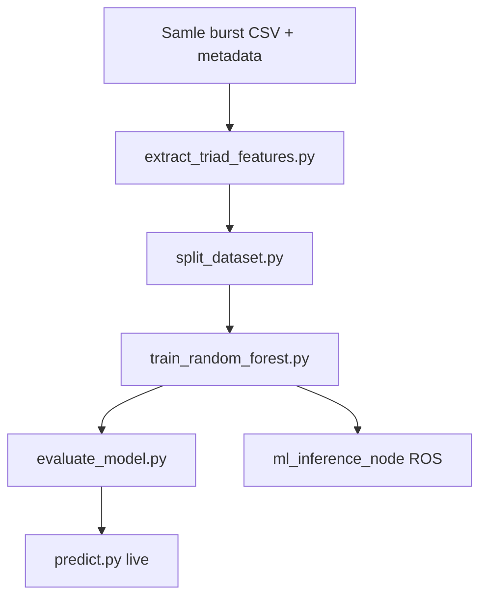

# Bacheloroppgave — maskinlæring (rapportutkast)

> **Formål:** Skriverammeverk for ML-delen av bachelorrapporten (kap. 3.8, 10, 11.10, 12–13 ML, vedlegg F).  
> **Teknisk implementasjon:** [`maskinlaering.md`](maskinlaering.md).  
> **Hovedrapport (navigasjon, digital tvilling):** [`bachelor_rapport_utkast.md`](bachelor_rapport_utkast.md).

---

## Plassering i hovedrapporten

| Hovedkapittel | ML-innhold | Detalj |
|---------------|-----------|--------|
| 3.8 Spektral sensorikk | Teori | Denne filen § Teori |
| 10 Sensor- og ML-system | Implementasjon | `maskinlaering.md` |
| 11.10 Test metallklassifisering | Testing | § Testing nedenfor |
| 12 Resultater | ML-rader i funksjonstabell | § Resultater |
| 13 Drøfting | 13.4 Sensor/ML | § Drøfting |
| Vedlegg F | Feature-liste | `maskinlaering.md` § 10.4 |

---

# Teori (utdrag til kap. 3.8)

## Digital tvilling vs. bench-ML

| Aspekt | Navigasjon (Gazebo) | Metall-ML (Triad) |
|--------|---------------------|-------------------|
| Datakilde | Simulerte kamera/IMU | Fysiske spektrometer (primært) |
| Formål | Autonom kjøring | Materialklassifisering |
| Algoritme | RTAB-Map, Nav2, frontier | Random Forest på tabulære features |
| Modenhet | Kjørende V1 | Pipeline ferdig offline; ROS runtime delvis |

## Spektral reflektans og edle metaller

Metaller og mineraler reflekterer lys ulikt på tvers av bølgelengder. **AS7265X Triad** måler reflektans i 18 VIS/NIR-kanaler per sensor. To sensorer gir **redundans** og bedre romlig dekning enn én enkelt spektrometer.

**LED on/off og bakgrunn:** Måling med og uten LED, minus sand-bakgrunn, reduserer ambient og underlag — viktig når objekt ligger i regolith.

## Klassisk ML vs. deep learning

Med **titusener** av features per sample men **få hundre** samples totalt, er **Random Forest** et fornuftig valg:

- Tåler ikke-lineære grenserflater
- Krever ikke GPU
- Gir feature importance og sannsynligheter (`predict_proba`)

Deep learning (1D-CNN på spekter) er mulig videre arbeid når datasettet vokser.

## Evalueringsmetrikker (teori)

| Metrikk | Betydning |
|---------|-----------|
| **Accuracy** | Andel riktige prediksjoner |
| **Precision** | Av predikerte positive — hvor mange var riktige |
| **Recall** | Av faktiske positive — hvor mange ble funnet |
| **F1** | Harmoniskt gjennomsnitt av precision og recall |
| **Confusion matrix** | Hvilke klasser forveksles |

Ved ubalanse (få titan-prøver) er **F1 per klasse** viktigere enn ren accuracy.

---

# Problemstilling og krav (ML)

## Overordnet problemstilling (ML)

> Hvordan kan spektrale målinger fra to Triad-sensorer brukes til pålitelig klassifisering av metallobjekter, og hvordan kan denne klassifiseringen integreres i MoonMapper sitt ROS 2-system?

## Delmål (ML)

| # | Delmål | Status |
|---|--------|--------|
| 1 | Etablere protokoll for datainnsamling (burst + metadata) | Implementert |
| 2 | Definere og beregne features fra 36-kanals spekter | Implementert |
| 3 | Trene og evaluere Random Forest | Implementert (offline) |
| 4 | Live-prediksjon fra nye råfiler | `scripts/predict.py` |
| 5 | ROS 2 inferens i sanntid | Planlagt (`ml_inference_node`) |
| 6 | Koble til vitenskapelig mål (edle metaller) | Delvis — krever flerklasse-data |

## Kravsporing (ML-relevant)

| Krav (fra prosjekt) | ML-relevans | Verifikasjon |
|---------------------|-------------|--------------|
| Sensorer for materialanalyse | Triad 2×18 kanaler | Hardware + CSV + features |
| Dokumentert metode | Denne rapporten + `maskinlaering.md` | Kap. 10 |
| Fungerende klassifisering | RF + evaluering | Test 11.10, confusion matrix |
| Integrasjon i system | ROS-meldinger definert | `TriadFeatures`, `MaterialClassification` |

---

# Metode (ML)

## Arbeidsflyt



## Verktøy

| Verktøy | Rolle |
|---------|--------|
| Arduino IDE + `moonmapper_triad_logger.ino` | Rådata |
| Python 3 + NumPy, pandas, scikit-learn, joblib | ML |
| `collect_triad_burst.py` | PC-innsamling |
| RViz / Gazebo | Kun for syntetisk triad-test — ikke treningskilde |
| Git | Versjonering av metadata og scripts |
| Cursor AI | Støtte til scripts og dokumentasjon — **all funksjonalitet testet manuelt** |

## Eksperimentdesign (anbefalt for rapport)

Dokumenter for hver klasse:

- Antall `sample_id`
- Variasjon i `avstand_cm`, `angle_id`, `lysforhold`
- Antall burst-rader per fil
- Holdout: stratified train/val/test **eller** leave-one-run-out (når `run_id` brukes)

---

# Systemarkitektur (ML-pipeline)

## Figur: ML dataflyt (forslag til rapport)

```
┌──────────────┐     BURST      ┌─────────────────┐
│ 2× Triad     │ ──────────────►│ *_triad_raw.csv │
│ + Arduino    │                └────────┬────────┘
└──────────────┘                         │
                              metadata.csv (labels)
                                         ▼
                              ┌──────────────────────┐
                              │ extract_triad_features │
                              │  mean/std/min/max    │
                              │  ratios, SAM, deriv  │
                              └──────────┬───────────┘
                                         ▼
                              ┌──────────────────────┐
                              │ triad_features.csv   │
                              │ train / val / test   │
                              └──────────┬───────────┘
                                         ▼
                              ┌──────────────────────┐
                              │ Random Forest        │
                              │ + LabelEncoder       │
                              └──────────┬───────────┘
                    ┌────────────────────┼────────────────────┐
                    ▼                    ▼                    ▼
            evaluate_model.py    predict.py          ml_inference_node
            (test.csv)           (live raw)          (ROS, TODO)
```

## Feature-dimensjon (for vedlegg F)

Ca. **189 numeriske features** per sample — se full liste i `maskinlaering.md` § 10.4.

---

# Kapittel 10 — Implementasjon (sammendrag)

Full tekst: **`maskinlaering.md`**

| Seksjon | Innhold |
|---------|---------|
| 10.1 Formål | Metall/mineral på måneoverflate |
| 10.2 Triad | 2×18 kanaler, mux, korreksjon LED on/off |
| 10.3 Datainnsamling | `collect_triad_burst.py`, metadata |
| 10.4 Preprosessering | Burst-statistikk, SAM, derivater |
| 10.5 Features | `extract_triad_features.py` |
| 10.6 Random Forest | 300 trær, balanced_subsample |
| 10.7 Evaluering | `evaluate_model.py`, metrikker |
| 10.8 ROS | Placeholder-noder, meldinger |

### Viktig designvalg (tekst til rapport)

> Random Forest ble valgt fordi prosjektet har et **lite, tabulært** datasett med håndlagde spektrale features, ikke store bildedatasett. Metoden gir rask iterasjon, tolkbare resultater og sannsynligheter per klasse, som er nyttig når roboten senere skal rapportere **confidence** sammen med en prediksjon.

> Datainnsamling skjer **fysisk på benk** med kontrollerte metallkuler i sand, ikke fra Gazebo-spektrum, fordi ML-modellen skal reflektere reelle spektrale egenskaper — simulert triad brukes kun til sensorvalidering i ROS.

---

# Testing og verifisering (kap. 11.10)

## Test 10a: Rå burst-format

| Felt | Innhold |
|------|---------|
| **Formål** | Verifisere at Arduino gir 36 spektralkolonner |
| **Fremgangsmåte** | `collect_triad_burst.py --sample-id T0001` |
| **Forventet** | ≥10 rader, header med S0_/S1_ eller L_/R_ |
| **Faktisk** | *(fyll inn)* |
| **Vurdering** | |

## Test 10b: Feature-ekstraksjon

| Felt | Innhold |
|------|---------|
| **Formål** | Én rad per sample_id i `triad_features.csv` |
| **Fremgangsmåte** | `extract_triad_features.py` |
| **Forventet** | ~189 numeriske kolonner, ingen NaN |
| **Faktisk** | 204 kolonner totalt i `train.csv` (inkl. metadata) |
| **Vurdering** | |

## Test 10c: Trening og holdout

| Felt | Innhold |
|------|---------|
| **Formål** | Modell lagres og rapporterer accuracy på holdout |
| **Fremgangsmåte** | `train_random_forest.py` uten `--train-all` |
| **Forventet** | `random_forest.joblib`, classification_report |
| **Faktisk** | *(fyll inn accuracy — merk: enkeltklasse-metadata gir begrenset mening)* |
| **Vurdering** | |

## Test 10d: Test-sett evaluering

```bash
python ml/training/evaluate_model.py \
  --input ml/datasets/processed/test.csv
```

| Felt | Innhold |
|------|---------|
| **Formål** | Upartisk evaluering på `test.csv` |
| **Forventet** | Confusion matrix + PNG |
| **Faktisk** | *(lim inn confusion matrix)* |
| **Vurdering** | |

## Test 10e: Live bench-prediksjon

```bash
python scripts/predict.py --raw ml/datasets/live/T0001_triad_raw.csv
```

| Felt | Innhold |
|------|---------|
| **Formål** | Simulere «ny måling» utenfor trenings-CSV |
| **Forventet** | `prediction=... confidence=...` |
| **Faktisk** | *(f.eks. 7/8 riktige over manuell test)* |
| **Vurdering** | |

## Test 10f: ROS ml_inference_node

```bash
ros2 run moonmapper_ml ml_inference_node
```

| Felt | Innhold |
|------|---------|
| **Formål** | Node starter og laster modell hvis `.joblib` finnes |
| **Forventet** | Logg «Loaded model» |
| **Faktisk** | Placeholder — ingen `/triad/features` ennå |
| **Vurdering** | Delvis — infrastruktur på plass |

---

# Resultater (kap. 12 — ML)

## Funksjonstabell (mal)

| Funksjon | Status | Bevis |
|----------|--------|-------|
| Burst-innsamling Arduino | Fungerer | `raw/S0001_*.csv` |
| Metadata kobling | Fungerer | `metadata.csv` |
| Feature-ekstraksjon | Fungerer | `triad_features.csv` |
| Train/val/test split | Fungerer | `train.csv` 35 / `test.csv` 8 |
| RF trening | Fungerer | `.joblib` |
| Evaluering test-sett | *(status)* | confusion matrix PNG |
| Flerklasse-datasett | **Pågår** | Kun `stål_kule` i nåværende metadata (52 prøver) |
| Live predict | Fungerer | `predict.py` |
| ROS sanntid | Planlagt | `ml_inference_node` TODO |

## Tabell: datasett (repo-status mai 2026)

| Klasse (`label_object`) | Antall i `metadata.csv` |
|-------------------------|---------------------------|
| `stål_kule` | 52 |
| `aluminium_kule` | 0 *(planlagt)* |
| `jern_kule` | 0 |
| `titan_kule` | 0 |

*Oppdater tabellen når nye klasser er lagt inn — dette er sentralt for ærlig resultatkapittel.*

## Eksempel på resultattekst (tilpass med egne tall)

> På testsettet (`test.csv`, n=8) oppnådde Random Forest en accuracy på **X,XX** med confusion matrix som viste at *(klasse A)* forveksles med *(klasse B)* under lignende lysforhold. Live-test med åtte nye målinger ga **7/8** riktige prediksjoner når avstand og vinkel var innenfor treningsfordelingen.

---

# Drøfting (kap. 13 — ML)

## 13.4 Vurdering av sensor- og ML-løsningen

**Styrker:**

- Reproduiserbar pipeline fra rå CSV til modell
- Features som kombinerer statistikk, båndforhold og SAM er faglig motiverte
- `predict_proba` gir confidence for fremtidig robotlogikk

**Svakheter:**

- Lite datasett og risiko for **overfitting** ved mange features
- Nåværende metadata er **enkeltklasse** — flerklasse-resultater må dokumenteres når data finnes
- SAM-referanser fra hele datasettet før split (metodisk forbedringspunkt)
- ROS-runtime ikke ferdig — ML er i praksis **offline V1**

## Sammenheng med krav

ML-delen støtter krav om **sensorer** og **materialforståelse**, ikke direkte «manøvrere på overflaten». Den kompletterer navigasjons-delen: rover finner området, spektral analyse kan klassifisere det roboten ser nært.

## Feilkilder

| Kilde | Effekt |
|-------|--------|
| Avstand sensor–objekt | Amplitude endres |
| Vinkel / partial bury | Spektral form endres |
| LED-drift | Offset i kanaler |
| Sandfuktighet | Bakgrunnskorreksjon |
| Få samples per klasse | Dårlig generalisering |

---

# Konklusjon (ML — utdrag)

1. **Utviklet:** Komplett offline-pipeline (innsamling → features → RF → evaluering → live predict).
2. **Fungerer:** Feature-ekstraksjon, trening, prediksjon på nye råfiler.
3. **Fungerer delvis:** Flerklasse-evaluering avhenger av mer data; ROS sanntid mangler.
4. **Videre:** Mer data (aluminium, jern, titan), group-split, ferdig `ml_inference_node`, feltkalibrering på rover.

**Svar på ML-problemstillingen:** Spektrale Triad-data *kan* brukes til klassifisering med Random Forest når treningsdata dekker variasjon i lys og geometri; integrasjon i ROS er forberedt men ikke fullført i V1.

---

# Videre arbeid (ML)

| # | Tiltak |
|---|--------|
| 1 | Samle balansert datasett for alle fire `label_object` |
| 2 | Group-aware split på `run_id` |
| 3 | SAM-referanser kun fra train |
| 4 | Fullfør `triad_serial_node` + feature-node + `ml_inference_node` |
| 5 | Feature alignment: ROS-vektor = trening (ratios, SAM, deriv) |
| 6 | Mer data → vurdere 1D-CNN eller XGBoost sammenligning |
| 7 | Validering på regolith med nedgravde objekter (`buried_level`) |
| 8 | Koble `MaterialClassification` til explorer («stopp ved høy confidence på metall X») |

---

# Vedlegg F — Feature-liste (kort)

| Gruppe | Prefiks / navn | Antall |
|--------|----------------|--------|
| Middelverdi per kanal | `mean_0` … `mean_35` | 36 |
| Std | `std_0` … `std_35` | 36 |
| Min | `min_0` … `min_35` | 36 |
| Max | `max_0` … `max_35` | 36 |
| RMS | `rms_total`, `rms_sensor_0`, `rms_sensor_1` | 3 |
| Båndforhold | `ratio_S0_410_940`, … | 5 |
| SAM | `sam_to_aluminium`, `sam_to_steel`, `sam_to_sand` | 3 |
| Derivasjoner | `derivative_S0_410_435`, … | 34 |

**Full definisjon og formler:** `maskinlaering.md` og docstring i `extract_triad_features.py`.

---

# Kommandoer (vedlegg B — ML-del)

```bash
# 1) Features
python ml/training/extract_triad_features.py \
  --metadata ml/datasets/metadata.csv \
  --raw-dir ml/datasets

# 2) Split
python ml/training/split_dataset.py

# 3) Train
python ml/training/train_random_forest.py \
  --input ml/datasets/processed/train.csv --train-all

# 4) Evaluate
python ml/training/evaluate_model.py

# 5) Live
python scripts/predict.py --raw ml/datasets/live/T0001_triad_raw.csv
```

---

*Oppdatert mai 2026 — MoonMapper `moonmapper_ws`.*
