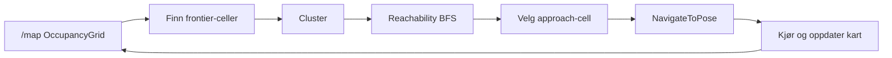
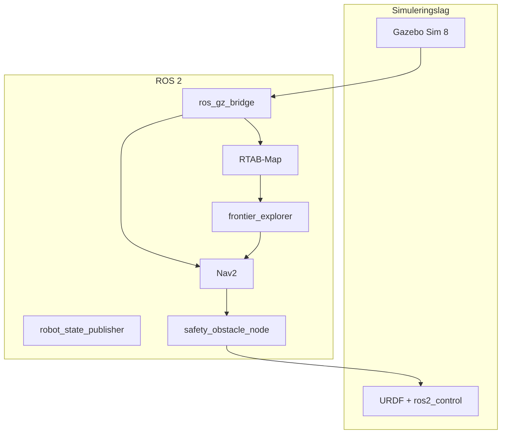
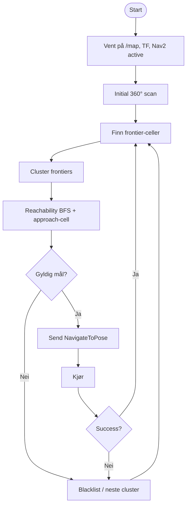

# Bacheloroppgave — rapportutkast (MoonMapper)

> **Formål:** Samlet skriverammeverk for bachelorrapporten. Tekst kan kopieres til LaTeX.  
> **Kapittel 6 (digital tvilling, teknisk dybde):** [`digital_tvilling.md`](digital_tvilling.md).

---

## Anbefalt kapittelrekkefølge

| Del | Kapittel |
|-----|----------|
| Foran | Sammendrag, Forord, Innholdsfortegnelse, Figurliste, Tabelliste, Forkortelser |
| 1 | Innledning |
| 2 | Problemstilling og krav |
| 3 | Teori og faglig grunnlag |
| 4 | Metode |
| 5 | Systemarkitektur |
| 6 | Implementasjon av digital tvilling → `digital_tvilling.md` |
| 7 | Implementasjon av kartlegging |
| 8 | Implementasjon av navigasjon |
| 9 | Implementasjon av autonom utforsking |
| 10 | Implementasjon av sensor- og ML-system |
| 11 | Testing og verifisering |
| 12 | Resultater |
| 13 | Drøfting |
| 14 | Konklusjon |
| 15 | Videre arbeid |
| Etter | Referanser, Vedlegg |

---

# Kapittel 1 — Innledning

## 1.1 Bakgrunn

MoonMapper er et studentprosjekt rettet mot autonom utforskning og kartlegging i månelignende miljø, med siktemål om å identifisere edle metaller og mineraler ved hjelp av spektral sensorikk. Før en fullskala fysisk månerover er ferdigstilt, er det behov for et trygt og repeterbart utviklingsmiljø der navigasjon, kartlegging og beslutningslogikk kan testes iterativt.

En **digital tvilling** — virtuell modell av robot, sensorer og miljø i **Gazebo Sim 8** med **ROS 2 Jazzy** — gjør det mulig å kjøre samme programvarestack som planlegges på den fysiske roboten, uten kostnad og risiko knyttet til feltforsøk i tidlig fase.

## 1.2 Problemområde

Autonom kartlegging krever samspill mellom:

- pålitelig **posesestimering** og TF,
- **SLAM** som bygger et kart,
- **Nav2** for planlagt bevegelse,
- og en strategi for å velge *hvor* roboten skal dra videre (her: **frontier-basert utforsking**).

Uten fysisk prototype må disse delsystemene verifiseres i simulasjon, med bevisst avvik mellom modell og virkelighet (friksjon, rocker-bogie-dynamikk, sensorstøy, lav gravitasjon).

## 1.3 Mål med oppgaven

Hovedmål: utvikle og dokumentere en digital tvilling som støtter **autonom kartlegging, navigasjon og sensorbasert beslutningstaking** i simulert arena.

Delmål (se også kap. 2.2):

1. Simulert rovermodell (URDF/Xacro, Gazebo).
2. ROS 2-kommunikasjon mellom sim, sensorer og navigasjon.
3. RTAB-Map for kartlegging (`/map`).
4. Nav2 for autonom navigasjon (`NavigateToPose`).
5. Frontier-basert utforsking (`frontier_explorer`).
6. Verifisere bevegelse, kartlegging og målvalg i sim.

## 1.4 Avgrensninger

**Dette arbeidet bygger ikke hele den fysiske måneroboten.** Fokus ligger på:

| Inkludert | Ikke hovedfokus |
|-----------|-----------------|
| Digital tvilling (Gazebo + ROS 2) | Full mekanisk produksjon av chassis |
| Simulering av bevegelse og sensorer | Komplett elektronikk-/PCB-design |
| RTAB-Map, Nav2, frontier-utforsking | Ferdig fysisk prototype klar for måne |
| Spektral/metall-ML (Triad, **offline** på fysisk hardware) | Syntetisk Triad i Gazebo; ROS ML-pakker (arkivert) |
| Dokumentasjon og kravsporing | Lavgravitasjon i Gazebo; multi-robot / sverm |

Den fysiske roveren (Dynamixel-driver, RealSense) beskrives som **referanse og fremtidig integrasjon**, ikke som hovedleveranse i denne oppgaven.

## 1.5 Rapportens oppbygning

Kap. 2 kobler oppgaven til krav. Kap. 3–4 gir teori og metode. Kap. 5 beskriver arkitektur (med figurer). Kap. 6–10 beskriver implementasjon. Kap. 11–12 tester og resultater. Kap. 13–15 drøfter, konkluderer og peker videre. Vedlegg inneholder topic-lister, launch-kommandoer og logger.

---

# Kapittel 2 — Problemstilling og krav

## 2.1 Overordnet problemstilling

> **Hvordan kan en digital tvilling av en MoonMapper-rover utvikles og brukes til å teste autonom kartlegging, navigasjon og sensorbasert beslutningstaking i et simulert månelignende miljø?**

## 2.2 Delmål

| # | Delmål | Leveranse i prosjektet |
|---|--------|------------------------|
| 1 | Simulert rovermodell i Gazebo | `moonmapper_rover.urdf.xacro`, `moonmapper_rover_gazebo.urdf.xacro`, `gazebo_rover.launch.py` |
| 2 | ROS 2-kommunikasjon robot ↔ sensorer ↔ navigasjon | `ros_gz_bridge`, `/depth_camera/*`, `cmd_vel_odom_relay`, `depth_to_scan_node` |
| 3 | RTAB-Map for kartlegging | `rtabmap_sim.launch.py`, database `~/.ros/moonmapper_rtabmap.db` |
| 4 | Nav2 for autonom navigasjon | `nav2_rtabmap_navigation.launch.py`, `nav2_params_rtabmap_sim.yaml` |
| 5 | Frontier-basert utforsking | `frontier_explorer` + `frontier_explorer.yaml` |
| 6 | Teste bevegelse, kartlegging og målvalg | `autonomous_exploration_full.launch.py`, kap. 11 |

## 2.3 Systemkrav (fra kravdokument — tolkning)

Kravdokumentet angir blant annet at roboten skal kunne **kartlegge måneoverflate**, **manøvrere på overflaten** og ha en **komplett 3D-modell** ved ferdigstilling. Dette begrunner at digital tvilling, simulering og navigasjon er sentrale i rapporten — de er verifikasjonsplattformen for funksjonene før fysisk deploy.

## 2.4 Tekniske krav

- ROS 2 Jazzy, `use_sim_time` i sim.
- TF-kjede: `map → odom → base_footprint → base_link → sensorframes`.
- Topics som autonomi forventer: `/map`, `/scan`, `/odom`, `/cmd_vel`, `/navigate_to_pose`.
- Frontier-node publiserer status og mål for sporing og debugging.

## 2.5 Avgrensning mot mekanikk, elektronikk og fysisk prototype

| Område | Status i oppgaven |
|--------|-------------------|
| Mekanikk (rocker-bogie, CAD) | Modellert i URDF/mesh; fysisk montering utenfor scope |
| Elektronikk (Dynamixel, Triad, mux) | Fysisk: Arduino-logger + `ml/`; sim: Gazebo-kamera/IMU (ikke syntetisk Triad) |
| Fysisk prototype | Fremtidig integrasjon; sim valgt fordi den tillater iterasjon på Nav2/SLAM nå |

## Kravsporing (tabell)

| Krav (SRQ/TRQ) | Relevans for digital tvilling | Hvordan det testes |
|----------------|------------------------------|-------------------|
| Kartlegge måneoverflate | RTAB-Map → `nav_msgs/OccupancyGrid` på `/map` | `ros2 topic echo /map --once`, RTAB-Map GUI, kartstørrelse over tid |
| Manøvrere på overflate | Nav2 + diff_drive i Gazebo | `NavigateToPose`, `/cmd_vel`, kjøretester i `earth_arena_explore` |
| Komplett 3D-modell robot | URDF + STL-mesh + SDF-verden | RViz RobotModel, inspeksjon av `meshes/visual/`, dokumentasjon |
| Dokumentasjon / arkitektur | Hele rapporten + vedlegg | Kap. 5, `\ref{appendix:system_arkitektur}`, Git |
| Spektral/metall (hvis i krav) | Triad på **fysisk** bench + offline ML (`ml/`, `predict.py`) | Kap. 10, test 11.10, confusion matrix |

*Sett inn eksakte SRQ/TRQ-nummer fra kravdokumentet i LaTeX-tabellen.*

---

# Kapittel 3 — Teori og faglig grunnlag

> **Mål:** Forklare *hva* teknologien er — ikke *hva du gjorde* (det kommer i kap. 6–10). Hold kapitlet målrettet (ca. 15–25 sider, ikke 30+).

## 3.1 Digital tvilling

I dette prosjektet er digital tvilling en **virtuell representasjon** av:

- robotgeometri og ledd (URDF),
- fysikk og kontakt (Gazebo),
- sensorer (kamera, IMU; Triad kun geometri i URDF — spektrum på fysisk robot),
- og programvareflyt (ROS 2-noder, topics, TF).

Tvillingen brukes til å teste oppførsel **før** fysisk robot er ferdig, og til å reprodusere feil (f.eks. TF-timing, frontier-målvalg) kontrollert.

## 3.2 Robot Operating System 2

Kort om **nodes**, **topics**, **actions**, **services**, **TF** og **launch**.

**Knyttet til MoonMapper:**

| Konsept | Eksempel i prosjektet |
|---------|----------------------|
| Topic | `/map`, `/scan`, `/cmd_vel`, `/cmd_vel_raw` |
| TF | `map → odom → base_footprint` |
| Action | `/navigate_to_pose` (Nav2) |
| Status-topic | `/frontier_explorer/status`, `/frontier_explorer/current_goal` |
| Launch | `autonomous_exploration_full.launch.py` orkestrerer sim + SLAM + Nav2 + explorer |

## 3.3 Simulering av mobile roboter

**Gazebo Sim** simulerer verden (SDF), fysikk (DART), sensorer og aktuatorer. **ros2_control** + **gz_ros2_control** kobler ROS-hastighetskommandoer til hjul.

Hvorfor simulasjon her: mulighet for **gjentakbare** tester av navigasjon og kartlegging uten hardware, med logging og pause/reset.

## 3.4 SLAM og kartlegging

**RTAB-Map** bygger et kart fra synkroniserte sensorstrømmer (depth/RGB, ev. scan) og odometri. Output inkluderer **2D occupancy grid** på `/map` og transform `map → odom` når lokalisering er aktiv.

## 3.5 Navigasjon med Nav2

Nav2 består av **planner** (global plan), **controller** (lokal hastighet, f.eks. MPPI), **costmaps** (global/lokal), **behavior tree** og **lifecycle**. Mål sendes typisk via action **`NavigateToPose`**.

## 3.6 Frontier-basert autonom utforsking

**Frontier** = grense mellom **kjent fri** celle og **ukjent** celle i occupancy grid.



Robotens loop (konseptuelt): `/map` → finn frontier → velg trygg **approach-cell** → send mål → kjør → oppdater kart → gjenta.

## 3.7 Sensorer for navigasjon og miljøforståelse

Fra sensor-research / prosjektdokumentasjon (tilpass etter deres kilder):

| Sensor | Rolle |
|--------|--------|
| Stereo / RGB-D | 3D-struktur, RTAB-Map, dybde |
| «LiDAR» / scan | Nav2 obstacle layer — her: **syntetisk** `/scan` fra `depth_to_scan_node` |
| IMU | Orientering, kan mates til EKF |
| Mikroskop / triad | Inspeksjon og spektral analyse (ikke primær Nav2-input) |

## 3.8 Spektral sensorikk og metallgjenkjenning

**Triad AS7265x** måler reflektans i flere bølgelengder. Edle metaller og mineraler kan ha **karakteristiske spektrale signaturer**. Pipeline: LED on/off → bakgrunnssubtraksjon → features → klassifikator (f.eks. Random Forest). Relevans: støtte for vitenskapelig mål om materialgjenkjenning, parallelt med navigasjon.

---

# Kapittel 4 — Metode

## 4.1 Utviklingsmetode

Iterativ utvikling: minimal sim (spawn + kjøring) → SLAM → Nav2 → safety → frontier explorer. Feil spores med ROS-logging, `ros2 topic echo`, RViz og dedikerte debug-strenger (`FRONTIER_DEBUG`, `GOAL_SELECTED`).

## 4.2 Verktøy og programvare

| Verktøy | Bruk |
|---------|------|
| Ubuntu 24.04 | Utviklings-OS |
| ROS 2 Jazzy | Middleware |
| Gazebo Sim 8 (Harmonic) | Simulasjon |
| RViz2 | Visualisering |
| RTAB-Map | SLAM |
| Nav2 | Navigasjon |
| SolidWorks / Blender (evt.) | CAD → STL |
| Git / GitHub | Versjonskontroll |
| Cursor AI | Programmeringsstøtte (se nedenfor) |

**Cursor AI** ble brukt som programmeringsstøtte for å generere forslag, refaktorere kode og dokumentere implementasjonen. All funksjonalitet ble **testet manuelt** i ROS 2/Gazebo-miljøet; forfatter har ansvar for integrasjon og verifikasjon.

## 4.3 Simuleringsmiljø

Standard test: `world_preset:=earth_explore` (3×6 m arena). Oppstart:

```bash
ros2 launch moonmapper_nav2 autonomous_exploration_full.launch.py \
  use_sim_time:=true world_preset:=earth_explore \
  start_sim:=true start_slam:=true start_nav2:=true start_explorer:=true \
  navigation_stack_delay:=12.0 explorer_extra_delay_sec:=5.0
```

## 4.4 Testmetodikk

Strukturert testplan (kap. 11): formål → fremgangsmåte → forventet → faktisk → vurdering. Loggutdrag og skjermbilder som bevis.

## 4.5 Versjonskontroll og iterativ utvikling

Git-branches for features (Nav2-tuning, frontier V1, safety). Commits knyttes til testkjøringer (vedlegg E).

---

# Kapittel 5 — Systemarkitektur

> **Mål:** Leser skal forstå systemet uten å lese kildekode. Minst **tre figurer** (Lagmodell, topic-flyt, frontier-loop).

## 5.1 Overordnet arkitektur



**Figur 1 (forslag):** Lagmodell — Gazebo → sensorer/robot → ROS topics/TF → RTAB-Map → Nav2 → frontier_explorer → cmd_vel.

### Aktive ROS 2-pakker (`src/`, mai 2026)

| Pakke | Rolle |
|-------|--------|
| `moonmapper_description` | URDF, Gazebo-verdener, `gazebo_rover`, rocker-bogie-plugin |
| `moonmapper_bringup` | `sim_rover_clean`, `cmd_vel_odom_relay` |
| `moonmapper_autonomy` | `depth_to_scan_node`, `safety_obstacle_node` |
| `moonmapper_nav2` | RTAB-Map, Nav2, `frontier_explorer` |

**Arkivert** under `arkiverte_koder/` (bygges ikke i aktiv `colcon`): bl.a. `moonmapper_gz_sensors`, `moonmapper_msgs`, `moonmapper_interfaces`, `moonmapper_perception`, `moonmapper_ml`, `moonmapper_localization`, `moonmapper_slam`, `moonmapper_mapping`, Webots. **ML uten ROS:** `ml/`, `scripts/predict.py`, `arduino/`.

## 5.2 ROS 2 node- og topic-arkitektur

**Figur 2 (forslag):** Topic/dataflyt

```
Gazebo → /depth_camera/*, /imu/data, /clock
       → depth_to_scan_node → /scan
       → diff_drive → /odom, TF odom→base_footprint

RTAB-Map → /map, TF map→odom

frontier_explorer ← /map, /tf
                  → /navigate_to_pose
                  → /frontier_explorer/status
                  → /frontier_explorer/current_goal

Nav2 → /cmd_vel_smoothed → collision_monitor → /cmd_vel_raw
safety_obstacle_node ← /scan, /cmd_vel_raw → /cmd_vel
cmd_vel_odom_relay → /diff_drive_controller/cmd_vel
```

## 5.3 Simuleringslag

`gazebo_rover.launch.py`, verdener (`earth_arena_explore.sdf`), `RockerBogieDifferential`-plugin, physics profiles.

## 5.4 Sensorlag

`ros_gz_bridge.yaml`, `depth_to_scan_node` (`/depth_camera/*` → `/scan`). RealSense-alias (`camera_aliases`) er arkivert. Se `digital_tvilling.md` § Sensorimplementasjon.

## 5.5 Kartleggingslag

`rtabmap_sim.launch.py`, `map_relay`, `nav2_map_ready_wait_node`.

## 5.6 Navigasjonslag

`controller_server`, `planner_server`, `bt_navigator`, costmaps — se `nav2_params_rtabmap_sim.yaml`.

## 5.7 Autonomilag

`frontier_explorer` + parametre i `frontier_explorer.yaml`.

## 5.8 Sikkerhetslag

`safety_obstacle_node`: gater `/cmd_vel_raw` → `/cmd_vel` basert på `/scan`. Nav2 `collision_monitor` konfigurert som pass-through; faktisk gating i safety-laget.

**Figur 3 (forslag):** Autonom utforskingsloop



Label i LaTeX: `\label{appendix:system_arkitektur}` for hoveddiagram i vedlegg.

---

# Kapittel 6 — Implementasjon av digital tvilling

**Full teknisk tekst:** [`digital_tvilling.md`](digital_tvilling.md)

Underseksjoner (sammendrag):

| Seksjon | Innhold |
|---------|---------|
| 6.1 Robotmodell og 3D-modell | STL-mesh, rocker-bogie, masse |
| 6.2 URDF/Xacro/SDF | Filhierarki, ledd, sensor-links |
| 6.3 Gazebo-verden | `moon` / `earth` / `earth_explore` |
| 6.4 Sensorimplementasjon | Bridge, RGB-D, IMU, triad-plugin |
| 6.5 ROS 2 launch-system | `gazebo_rover`, `sim_rover_clean`, orkestrering |
| 6.6 TF-struktur | `map→odom→base_footprint→base_link` |
| 6.7 cmd_vel-kjede | relay, diff_drive, *ikke* bro til GZ |

**Designvalg (tekstforslag):** Gazebo ble valgt fordi det muliggjør testing av **robotbevegelse**, **sensorer** og **miljøinteraksjon** (kontakt, friksjon) uten fysisk prototype, med samme ROS 2-stack som planlagt på hardware.

---

# Kapittel 7 — Implementasjon av kartlegging

## 7.1 RTAB-Map-integrasjon

`rtabmap_sim.launch.py` kjøres med `use_sim_time:=true`, database `~/.ros/moonmapper_rtabmap.db`. Start forsinkes typisk **6 s** etter sim-spawn (`sim_stabilization_before_slam_sec`).

## 7.2 Sensorinput til kartlegging

Depth/RGB fra `/depth_camera/*` (eller alias `/camera/camera/...`). Odometri fra `/odom`. `/scan` kan støtte visualisering/obstacle — generert fra dybde.

## 7.3 OccupancyGrid `/map`

RTAB-Map publiserer 2D occupancy grid. Størrelse og oppløsning endres etter hvert som roboten utforsker.

## 7.4 TF-kjede `map → odom → base_footprint`

Kritisk for Nav2 og frontier. `nav2_map_ready_wait_node` venter på gyldig kart *og* TF før Nav2 startes (forsinkelse 12 s i full stack).

## 7.5 Map-ready wait node

`moonmapper_nav2/nav2_map_ready_wait_node.py` — reduserer race der Nav2 starter før `/map` og `map→odom` er konsistente.

## 7.6 Utfordringer med kartkvalitet

| Problem | Årsak | Tiltak i prosjektet |
|---------|--------|---------------------|
| Lite kart ved start | Robot står stille | `integrated_initial_spin` (360°) |
| Nav2 før kart | Timing | `navigation_stack_delay`, map_ready_wait |
| TF mangler tidlig | Launch-rekkefølge | Forsinkelser, `tf2_echo`-sjekk |
| «Missing visual features» | Lite tekstur i arena | Akseptert begrensning V1; hjørnestolper i verden |
| Loop closure-advarsler | Repeterende struktur | Logging; tuning av RTAB-Map-parametre |

---

# Kapittel 8 — Implementasjon av navigasjon

## 8.1 Nav2 bringup

`nav2_rtabmap_navigation.launch.py` med `nav2_params_rtabmap_sim.yaml`.

## 8.2 Lifecycle nodes

`controller_server`, `planner_server`, `smoother_server`, `bt_navigator`, `behavior_server`, `velocity_smoother`, `collision_monitor` — aktiveres via lifecycle manager.

## 8.3 Global og lokal costmap

Inflation, robot radius/footprint (`base_footprint`), obstacle layer fra `/scan`.

## 8.4 Planner og controller

Global planner + **MPPI** (eller konfigurert controller) genererer `/cmd_vel_smoothed`.

## 8.5 cmd_vel-kjede

```
cmd_vel_smoothed → collision_monitor → /cmd_vel_raw
→ safety_obstacle_node → /cmd_vel → cmd_vel_odom_relay → diff_drive
```

## 8.6 Safety obstacle node

`moonmapper_autonomy/safety_obstacle_node.py` — stopper/reduserer lineær fart ved hindring i `/scan` (f.eks. 0,65 m, 45° sektor).

## 8.7 Tuning av hastighet og obstacle clearance

Lavere `max_velocity`, større inflation og tryggere frontier-approach etter observasjon:

> Etter at roboten begynte å navigere autonomt, ble det observert at den valgte mål for nær vegger og hindringer. Dette førte til behov for tryggere målvalg, større hindringsklaring og lavere hastigheter.

*(Juster med konkrete parameternavn fra `frontier_explorer.yaml` og Nav2-YAML etter dine siste endringer.)*

---

# Kapittel 9 — Implementasjon av autonom utforsking

## 9.1 Prinsipp

Se kap. 3.6. Implementert i `frontier_explorer.py` + `frontier_grid.py`.

## 9.2 `frontier_explorer` node

Publiserer bl.a. `/frontier_explorer/status`, `/frontier_explorer/current_goal`. Abonnerer på `/map`, bruker TF til å plassere robot i grid.

## 9.3 Karttolkning

Celler: **unknown** (-1), **free** (0), **occupied** (100) — i tråd med `nav_msgs/OccupancyGrid`.

## 9.4 BFS og reachability

Reachability fra robot-celle; tidligere feil når robot-celle var **unknown** → ingen seed.

## 9.5 Frontier clustering

`FRONTIER_DEBUG raw_cells=… clusters=…` — logger antall frontier-celler og klynger.

## 9.6 Approach-cell og målvalg

Valg av celler roboten kan nå med sikker margin til vegger; `GOAL_SELECTED world=(x,y)`.

## 9.7 Blacklist og retry

Ved Nav2-feil (`Failed to make progress`, timeout): blacklist cluster, prøv neste.

## 9.8 Status og debugging

Eksempel på logglinjer (fra implementasjonen):

```
FRONTIER_DEBUG raw_cells=1169 clusters=54 after_reachable=1 reason=goal_selected
GOAL_SELECTED world=(-0.24,-0.62) approach=...
SENDING_NAV2_GOAL
```

## 9.9 Utviklingsproblemer og forbedringer (ærlig historikk)

| Fase | Symptom | Årsak | Tiltak |
|------|---------|-------|--------|
| V0 | Frontier funnet, ingen mål | `no_approach_cell` | Approach-logikk, footprint clearing |
| V0 | BFS uten seed | Robot-celle unknown | Seed-søk, clear robot footprint |
| V1 | `GOAL_SELECTED` + Nav2 kjører | — | Tuning av marginer mot vegger |
| V1+ | For nær hindring | Kostmap/målvalg | Større clearance, lavere hastighet |

---

# Kapittel 10 — Implementasjon av sensor- og ML-system

> **Full teknisk dybde:** [`maskinlaering.md`](maskinlaering.md)  
> **ML-rapportutkast (teori, tester, resultater, vedlegg F):** [`bachelor_rapport_maskinlaering_utkast.md`](bachelor_rapport_maskinlaering_utkast.md)

Kort sammendrag:

| Seksjon | Innhold |
|---------|---------|
| 10.1 Formål | Spektral klassifisering av metallkuler / mineral |
| 10.2 Triad | 2× AS7265X, 36 kanaler, Arduino + mux |
| 10.3–10.4 Data + preprocess | Burst CSV, LED on/off, feature-statistikk |
| 10.5–10.7 ML | ~189 features → Random Forest (300 trær) → evaluering |
| 10.8 Inferens | Offline: `scripts/predict.py` + `ml/models/*.joblib` |
| 10.9 ROS (arkivert) | `moonmapper_interfaces`, `moonmapper_perception`, `moonmapper_ml` — planlagt sanntid, ikke i aktiv stack |

**Datasett (repo):** 52 stål-prøver i `metadata.csv`; pipeline klar for fire klasser (`labels.yaml`). Fyll inn egne flerklasse-resultater i ML-rapportutkastet.

**Innsamling (fysisk):** `python ml/data_collection/collect_triad_burst.py --port /dev/ttyACM0 --sample-id …`  
**Live-test:** `python scripts/predict.py --raw ml/datasets/live/...`

---

# Kapittel 11 — Testing og verifisering

Bruk samme mal for hver test:

| Felt | Innhold |
|------|---------|
| **Formål** | Hva testes |
| **Fremgangsmåte** | Launch, kommandoer, observasjon |
| **Forventet resultat** | Kriterium for bestått |
| **Faktisk resultat** | Hva skjedde |
| **Vurdering** | Bestått / delvis / feilet |

## 11.1 Testoppsett

PC med GPU (ogre2), ROS 2 Jazzy, workspace bygget med `colcon build`.

## 11.2 Test 1: Oppstart av simulering

**Formål:** Verifisere Gazebo + spawn.  
**Fremgangsmåte:** `sim_rover_clean.launch.py` eller full stack med `start_sim:=true`.  
**Forventet:** Rover synlig, `/clock`, `/joint_states`.  
**Faktisk:** *(fyll inn + skjermbilde)*  
**Vurdering:** …

## 11.3 Test 2: TF og ROS 2-kommunikasjon

```bash
ros2 run tf2_ros tf2_echo map odom
ros2 run tf2_ros tf2_echo odom base_footprint
```

## 11.4 Test 3: RTAB-Map kartlegging

`ros2 topic echo /map --once`, RTAB-Map GUI, kart vokser etter kjøring/spin.

## 11.5 Test 4: Nav2 manuell NavigateToPose

```bash
ros2 action send_goal /navigate_to_pose nav2_msgs/action/NavigateToPose "..."
```

## 11.6 Test 5: Initial 360° scan

`integrated_initial_spin:=true` — robot roterer, kart fylles.

## 11.7 Test 6: Frontier detection

`ros2 topic echo /frontier_explorer/status` — `raw_cells` > 0, `clusters` > 0.

## 11.8 Test 7: Autonom kjøring til frontier-mål

**Formål:** `frontier_explorer` sender mål til Nav2.  
**Fremgangsmåte:** `autonomous_exploration_full.launch.py`.  
**Forventet:** `GOAL_SELECTED`, `SENDING_NAV2_GOAL`, Nav2 NAVIGATING.  
**Faktisk:** *(loggutdrag)*  
**Vurdering:** V1 fungerer; robust hindringsunngåelse krever videre tuning.

## 11.9 Test 8: Hindringsunngåelse og stuck

Observer `safety_obstacle`, Nav2 recovery, `Failed to make progress`.

## 11.10 Test 9: Metallklassifisering (fysisk bench, offline)

**Fremgangsmåte:** `collect_triad_burst.py` → `scripts/predict.py` (ikke ROS ML-pakker).  
**Forventet:** Riktig `label_object` med confidence over terskel.  
**Faktisk / vurdering:** *(fyll inn — se `bachelor_rapport_maskinlaering_utkast.md` test 10e)*

---

# Kapittel 12 — Resultater

## Funksjonstabell (mal)

| Funksjon | Status | Bevis |
|----------|--------|-------|
| Gazebo spawn | Fungerer / delvis | Skjermbilde |
| RTAB-Map `/map` | Fungerer | topic / RViz |
| TF `map→odom→base_footprint` | Fungerer | `tf2_echo` |
| Nav2 lifecycle active | Fungerer | `ros2 lifecycle get` |
| Frontier detection | Fungerer | `FRONTIER_DEBUG` |
| NavigateToPose | Fungerer | `GOAL_SELECTED` |
| Autonom kjøring | Delvis | logger |
| Robust obstacle avoidance | Delvis | stuck ved vegger |
| Metall-ML | *(status)* | confusion matrix |

**Vær ærlig** — delvis fungerende resultater styrker rapporten.

## Målbare observasjoner

- Robot spawner med `base_footprint` i konfigurert `spawn_z`.
- `/map` publiseres; map width/height endres over tid.
- `frontier_explorer` går fra `no_approach_cell` til `GOAL_SELECTED`.
- Nav2 mottar og utfører mål (inntil recovery).

---

# Kapittel 13 — Drøfting

## 13.1 Digital tvilling som utviklingsverktøy

Tvillingen gjorde det mulig å teste Nav2 og frontier **før** fysisk robot var klar. Iterasjonshastighet var høy; fidelitet mot måne-miljø er begrenset.

## 13.2 Autonom navigasjon

Fungerer som prinsipp; følsom for costmap-parametere, kartkvalitet og målvalg nær vegger.

## 13.3 Kartlegging

RTAB-Map leverer brukbare kart i `earth_explore`; tekstur og loop closure er utfordringer.

## 13.4 Sensor- og ML-løsning

Triad/RF kan skille materialer under kontrollerte forhold; generalisering til felt er usikker.

## 13.5 Begrensninger

Jord-gravitasjon, forenklet friksjon, syntetisk scan, ikke full fysisk rover.

## 13.6 Feilkilder

Timing (TF, map), sensorstøy, MPPI + safety konkurrerer ikke men seriekobles.

## 13.7 Sammenheng med krav

Digital tvilling **dekker verifikasjon** av kartlegging, manøvrering og 3D-modell i sim — ikke endelig måneklar robot.

---

# Kapittel 14 — Konklusjon

**Struktur (tekstforslag):**

1. **Utviklet:** Digital tvilling (Gazebo + ROS 2), RTAB-Map, Nav2, frontier V1, safety, Triad/ML (hvis med).
2. **Fungerer:** Spawn, `/map`, TF, frontier-målvalg, NavigateToPose, autonom kjøring i kontrollert arena.
3. **Fungerer delvis:** Robust hindringsunngåelse, realistisk terrenggrep.
4. **Videre:** Se kap. 15.
5. **Svar på problemstillingen:** En digital tvilling *kan* utvikles og brukes til å teste autonom kartlegging og navigasjon i simulert miljø; resultatene er lovende men krever videre modenhet før måne-relevans.

---

# Kapittel 15 — Videre arbeid

| # | Retning | Begrunnelse |
|---|---------|-------------|
| 15.1 | Bedre Nav2-tuning | Marginer, hastighet, recovery |
| 15.2 | Mer realistisk roverfysikk | Friksjon, masse, rocker-bogie |
| 15.3 | Rocker-bogie dynamikk | Plugin `weak` → kalibrert `full` |
| 15.4 | Sensorstøy / realistiske kameramodeller | Overgang sim → felt |
| 15.5 | Bedre frontier scoring | Ikke bare nærmeste frontier |
| 15.6 | Multi-robot | Utenfor V1, mulig utvidelse |
| 15.7 | Integrasjon mot fysisk robot | `dynamixel_driver`, RealSense |
| 15.8 | Forbedret metallgjenkjenning | Mer data; ev. gjenopprett/implementer ROS ML fra arkiv eller mission-node |
| 15.9 | Lavatunnel / georadar-sim | Fremtidig vitenskapelig modul |

Formuler som **naturlig videreutvikling**, ikke som «vi rakk ikke».

---

# Vedlegg (forslag)

| Vedlegg | Innhold |
|---------|---------|
| A | Full ROS 2 node- og topic-liste (`ros2 node list`, `ros2 topic list`) |
| B | Launch-kommandoer (sim, full autonomi, teleop) |
| C | Viktige YAML-parametre (`nav2_params_rtabmap_sim.yaml`, `frontier_explorer.yaml`) |
| D | Testlogger (`FRONTIER_DEBUG`, Nav2) |
| E | Git-branch og commit-oversikt |
| F | ML feature-liste (`extract_triad_features.py`) |
| G | Skjermbilder Gazebo, RViz, RTAB-Map |

**Ikke** legg fulle kildefiler i hovedrapporten — vis korte utdrag, lenk til GitHub.

---

# Must-have sjekkliste før innlevering

- [ ] Systemarkitekturdiagram (kap. 5 / vedlegg)
- [ ] ROS node/topic-diagram
- [ ] Autonom frontier-loop diagram
- [ ] Forklaring Gazebo + ROS 2 + RTAB-Map + Nav2
- [ ] Forklaring `frontier_explorer` + utviklingshistorikk (`no_seed` → `GOAL_SELECTED`)
- [ ] Testtabeller (kap. 11)
- [ ] Skjermbilder Gazebo og RTAB-Map
- [ ] Kravsporing SRQ/TRQ (kap. 2)
- [ ] Ærlig drøfting av begrensninger (kap. 13)
- [ ] Kap. 6 teknisk detalj: `digital_tvilling.md`
- [ ] Kap. 10 ML teknisk detalj: `maskinlaering.md`
- [ ] ML-rapport (tester, resultater): `bachelor_rapport_maskinlaering_utkast.md`

---

*Oppdatert mai 2026 — MoonMapper `moonmapper_ws`.*
