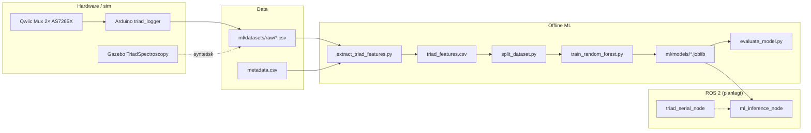

# Maskinlæring — Triad-spektroskopi og metallklassifisering

> **Formål:** Teknisk dybde for kap. 10 (*Implementasjon av sensor- og ML-system*) og vedlegg om ML-pipeline.  
> **Rapportutkast (ML-kapitler, teori, tester):** [`bachelor_rapport_maskinlaering_utkast.md`](bachelor_rapport_maskinlaering_utkast.md).  
> **Hovedrapport:** [`bachelor_rapport_utkast.md`](bachelor_rapport_utkast.md).

---

## Innledning

MoonMapper-prosjektet skal kunne skille materialer som er relevante for edle metaller og mineraler på måneoverflate. **Spektral reflektans** fra **SparkFun AS7265X Triad** (to sensorer × 18 kanaler = **36 bølgelengder**) brukes som input til en **supervised** klassifikator — baseline: **Random Forest** i scikit-learn.

Pipeline er delt i:

1. **Datainnsamling** (Arduino + PC, eller syntetisk/Gazebo)
2. **Feature-ekstraksjon** (burst → én rad med ~190 numeriske features)
3. **Trening / evaluering** (train/val/test, `.joblib`)
4. **Inferens** (Python `scripts/predict.py`; ROS 2 `moonmapper_ml` — delvis placeholder)

---

## Systemoversikt



---

## 10.1 Formål med metallgjenkjenning

| Mål | Beskrivelse |
|-----|-------------|
| Vitenskapelig | Skille metalltyper (stål, jern, aluminium, titan) og sand/regolith basert på spektral signatur |
| Teknisk | Reproducerbar pipeline fra rå måling → label + confidence |
| Integrasjon | Senere koble prediksjon til rover-beslutning (stopp, merke punkt, rapportere) |

Dette er **ikke** hovedleveransen for autonom navigasjon (se `digital_tvilling.md`), men et **parallelt delsystem** som deler prosjektets sensor-narrativ.

---

## 10.2 Triad AS7265X — hardware og protokoll

### Hardware

- **2×** SparkFun AS7265X Triad på **Qwiic Mux (TCA9548A)**
- Port 0 → sensor 0 (`S0_*` / `L_*`), port 1 → sensor 1 (`S1_*` / `R_*`)
- **18 kanaler per sensor**, bølgelengder (nm): 410, 435, 460, …, 940 (se `ml/configs/feature_config.yaml`)

### Korreksjon (Arduino)

Per sensor og burst:

```
corrected = LED_ON - LED_OFF - sand_background
```

`sand_background` kalibreres med kommando `SB` i `arduino/moonmapper_triad_logger/moonmapper_triad_logger.ino`.  
Full kodedokumentasjon: [`docs/triaddokumentasjon.md`](docs/triaddokumentasjon.md).

### Serial-protokoll (PC ↔ Arduino)

Python `ml/data_collection/collect_triad_burst.py`:

1. Sender: `BURST <sample_id>`
2. Mottar header + **20 datarader** (forventet) med CSV:  
   `sample_id,burst_index,timestamp_ms,S0_410,…,S1_940` (+ valgfritt normaliserte `N0_*`, `N1_*`)

Output: `ml/datasets/raw/<sample_id>_triad_raw.csv`

---

## 10.3 Datainnsamling

### Mappestruktur

```
ml/
├── configs/
│   ├── labels.yaml          # Klassedefinisjoner
│   └── feature_config.yaml  # Kanaler, feature-flagg
├── datasets/
│   ├── metadata.csv         # sample_id ↔ fil ↔ labels
│   ├── raw/                 # *_triad_raw.csv
│   ├── processed/           # triad_features.csv, train/val/test
│   └── live/                # T* / S999* testfiler
├── data_collection/
│   └── collect_triad_burst.py
├── training/
│   ├── extract_triad_features.py
│   ├── split_dataset.py
│   ├── train_random_forest.py
│   └── evaluate_model.py
└── models/                  # .joblib (ofte .gitignore)
```

### Metadata (`metadata.csv`)

Obligatoriske kolonner: `sample_id`, `triad_file` (relativ sti under `raw/`).

Typiske label-/kontekstkolonner:

| Kolonne | Eksempel | Bruk |
|---------|----------|------|
| `label_object` | `stål_kule`, `aluminium_kule` | **Primær treningslabel** (`primary_label` i `labels.yaml`) |
| `label_material` | `stål`, `aluminium` | SAM-referanser, materialnivå |
| `sand_type` | `torr_sand` | Kontekst |
| `lysforhold` | `lampelys` | Kontekst |
| `avstand_cm` | `12` | Avstand sensor–objekt |
| `position_id`, `angle_id`, `run_id` | P1, A30, R01 | Variasjon / senere group-split |
| `diameter_mm`, `size_group` | 4.5, `liten` | Objektstørrelse |

**Status i repo (mai 2026):** `metadata.csv` inneholder **52** rader, alle `label_object=stål_kule` / `label_material=stål`. Pipeline og `labels.yaml` er klargjort for **fire objektklasser**; flerklasse-evaluering krever innsamling av aluminium/jern/titan (eller bruk av `metadata_example_binary_steel_vs_aluminium.csv` for binært eksperiment).

### Anbefalt innsamlingsprotokoll

Fra `feature_config.yaml`:

- **Anbefalt:** ≥ 20 burst-rader per objekt
- **Minimum:** ≥ 10 rader per objekt
- Varier systematisk: `position_id`, `angle_id`, `avstand_cm`, `lysforhold`
- Hold `run_id` konsistent per oppsett (for fremtidig group-aware split)

### Kommando: samle én burst

```bash
cd moonmapper_ws
pip install pyserial pandas scikit-learn joblib  # ML-miljø

python ml/data_collection/collect_triad_burst.py \
  --port /dev/ttyACM0 \
  --sample-id S0054 \
  --label-object aluminium_kule \
  --label-material aluminium \
  --append-metadata
```

---

## 10.4 Preprosessering

### Rå CSV → burst (liste av 36-kanals vektorer)

`read_triad_raw_csv()` i `extract_triad_features.py` aksepterer:

- `S0_410 … S0_940` + `S1_410 … S1_940`, eller
- `L_410 … L_940` + `R_410 … R_940`

Ekstra kolonner (`N0_*`, `N1_*`, tidsstempel) ignoreres ved feature-beregning.

### Burst → én feature-rad per `sample_id`

For hver burst (typisk 11–20 rader i praksis) beregnes statistikk **per kanal** over alle rader i burst:

| Feature-gruppe | Kolonner | Antall |
|----------------|----------|--------|
| Middelverdi | `mean_0` … `mean_35` | 36 |
| Standardavvik | `std_0` … `std_35` | 36 |
| Minimum | `min_0` … `min_35` | 36 |
| Maksimum | `max_0` … `max_35` | 36 |
| RMS | `rms_total`, `rms_sensor_0`, `rms_sensor_1` | 3 |
| Båndforhold | `ratio_S0_410_940`, `ratio_S1_410_940`, … | 5 |
| Spektral vinkel (SAM) | `sam_to_aluminium`, `sam_to_steel`, `sam_to_sand` | 3 |
| Derivasjoner | `derivative_S0_410_435`, … (17 per sensor) | 34 |
| **Sum numeriske features** | | **~189** |

*Båndforhold:* `teller / (nevner + 1e-6)` — mindre følsom for total signalstyrke.

### Spectral Angle Mapper (SAM)

Referansespekter beregnes som gjennomsnittlig `mean_36` per klasse (`aluminium`, `steel`, `sand`) fra `label_material` i metadata. Lagres som:

`ml/datasets/processed/sam_reference_spectra.json`

Brukes ved både trening og live-prediksjon (`scripts/predict.py`).

**Merk:** Referanser beregnes i dag fra **alle** metadata-rader før split — for streng vitenskapelig evaluering bør SAM-ref kun bygges på **train**-delmengde.

---

## 10.5 Feature extraction — kjøring

```bash
python ml/training/extract_triad_features.py \
  --metadata ml/datasets/metadata.csv \
  --raw-dir ml/datasets \
  --output ml/datasets/processed/triad_features.csv
```

Output: `triad_features.csv` + `sam_reference_spectra.json`

Wrapper fra repo-rot:

```bash
python scripts/extract_features.py
```

---

## 10.6 Datasett-split

```bash
python ml/training/split_dataset.py \
  --input ml/datasets/processed/triad_features.csv \
  --output-dir ml/datasets/processed \
  --train-frac 0.7 --val-frac 0.15 --test-frac 0.15 \
  --stratify
```

Genererer:

| Fil | Rader (eksempel i repo) |
|-----|-------------------------|
| `train.csv` | 35 (+ header) |
| `val.csv` | 8 |
| `test.csv` | 8 |

**TODO i kode:** group-aware split på `run_id` for å unngå leakage mellom train og test.

---

## 10.7 Random Forest-modell

### Algoritmevalg (begrunnelse)

| Valg | Begrunnelse |
|------|-------------|
| Random Forest | Robust på tabulære features, lite tuning, interpretérbar feature importance |
| Ikke deep learning | Lite datasett (~50–200 samples), høy risiko for overfitting |
| `class_weight=balanced_subsample` | Håndterer ubalanse når flere klasser legges inn |

### Hyperparametre (`train_random_forest.py`)

```python
RandomForestClassifier(
    n_estimators=300,
    random_state=42,
    n_jobs=-1,
    class_weight="balanced_subsample",
)
```

### Trening

```bash
# Evaluerer internt 80/20 hvis du trener på hele triad_features.csv:
python ml/training/train_random_forest.py \
  --input ml/datasets/processed/triad_features.csv \
  --label-column label_object

# Trener på alle rader i train.csv (anbefalt etter split):
python ml/training/train_random_forest.py \
  --input ml/datasets/processed/train.csv \
  --train-all \
  --model-output ml/models/random_forest.joblib \
  --encoder-output ml/models/label_encoder.joblib
```

**Metadata ekskludert fra X:** `sample_id`, `label_*`, `triad_file`, `sand_type`, `lysforhold`, `avstand_cm`, osv. (se `NON_FEATURE_COLUMNS_DEFAULT` i treningsscript).

**Label:** standard `label_object` (kan settes til `label_material`).

### Artefakter

| Fil | Innhold |
|-----|---------|
| `ml/models/random_forest.joblib` | Trenet modell |
| `ml/models/label_encoder.joblib` | `LabelEncoder` (tekst → klasseindeks) |

Kopier til ROS ved behov: `src/moonmapper_ml/models/` (se `models/README.md` — store filer bør ikke committes).

---

## 10.8 Evaluering

```bash
python ml/training/evaluate_model.py \
  --model_path ml/models/random_forest.joblib \
  --encoder_path ml/models/label_encoder.joblib \
  --input ml/datasets/processed/test.csv \
  --cm-out ml/datasets/processed/confusion_matrix.png
```

**Metrikker som skrives ut:**

- **Confusion matrix**
- **Classification report:** precision, recall, F1 per klasse, accuracy

### Live-prediksjon (én rå fil)

```bash
python scripts/predict.py --raw ml/datasets/live/T0001_triad_raw.csv
```

- Bruker samme feature-ekstraktor + SAM-JSON som trening
- Default `--max-rows 11` for å matche typisk burst-lengde i treningsdata
- Output: `prediction=<klasse> confidence=<0–1>` + sannsynligheter

**Fyll inn egne resultater i rapporten**, f.eks.:

| Eksperiment | N test | Accuracy | Merknad |
|-------------|--------|----------|---------|
| 4-klasse holdout | *(n)* | *(%)*
| Binær stål vs aluminium | *(n)* | *(%)*
| Live bench (8 prøver) | 8 | 7/8 | avstand/vinkel varierer |

---

## 10.9 Integrasjon mot ROS 2

### Meldinger (`moonmapper_interfaces`)

| Melding | Status | Innhold |
|---------|--------|---------|
| `TriadRaw.msg` | Definert | Rå burst (planlagt fra serial) |
| `TriadFeatures.msg` | Definert | `mean_36`, `std_36`, `min_36`, `max_36`, RMS |
| `MaterialClassification.msg` | Definert | `predicted_class`, `confidence`, `probabilities` |

### Pakker

| Node | Fil | Status |
|------|-----|--------|
| `triad_serial_node` | `moonmapper_perception/triad_serial_node.py` | **Placeholder** — skal lese serial, publisere `TriadRaw` |
| `ml_inference_node` | `moonmapper_ml/inference_node.py` | **Placeholder** — laster `.joblib`, TODO: `/triad/features` → `/ml/triad_classification` |
| `feature_utils.py` | Konvertering msg → vektor | Delvis — mangler ratios/derivatives/SAM i ROS-vektor |

### Gazebo (syntetisk spektrum)

`moonmapper_gz_sensors`: plugin `TriadSpectroscopy` raycaster mot `triad_material_map.yaml` → topics `/triad_sensor_1/spectrum`, `/triad_sensor_2/spectrum`.  
Brukes til **Level-1 sensor-test**, ikke direkte som treningsdata for RF-modellen (skille sim vs bench-data i rapporten).

### Planlagt runtime-flyt

```
Arduino → triad_serial_node → TriadRaw
       → (feature_node?) → TriadFeatures
       → ml_inference_node → MaterialClassification
```

---

## Klassedefinisjoner (`ml/configs/labels.yaml`)

**Objektklasser (primær label):**

- `aluminium_kule`
- `jern_kule`
- `stål_kule`
- `titan_kule`

**Materialklasser:**

- `aluminium`, `jern`, `stål`, `titan`, `ukjent`

`primary_label: label_object`

---

## Designvalg og begrensninger

| Tema | Valg / begrensning |
|------|-------------------|
| Lite datasett | RF, ikke CNN; stratified split; ærlig rapport om generalisering |
| Én klasse i nåværende metadata | Modell kan ikke evalueres meningsfullt på test før flere klasser finnes |
| Variasjon | Lys, avstand, vinkel påvirker spekter sterkt — må dokumenteres |
| Burst-lengde | `predict.py` kutter til 11 rader — må matche treningsprotokoll |
| ROS | Offline ML er moden; sanntids-ROS er neste steg |
| SAM leakage | Ref fra alle samples — dokumenter som metodisk svakhet |

---

## Feilsøking

| Symptom | Mulig årsak | Tiltak |
|---------|-------------|--------|
| `Missing raw triad files` | Feil `--raw-dir` eller `triad_file` i metadata | Sjekk sti `ml/datasets/raw/...` |
| `No numeric feature columns` | Tom CSV eller manglende extract | Kjør `extract_triad_features.py` først |
| `joblib not available` | Mangler pip-pakke i miljø | `pip install joblib` |
| Live pred alltid samme klasse | Kun én klasse i trening | Samle flere klasser |
| Features mismatch | Kolonnerekkefølge | `predict.py` bruker `model.feature_names_in_` |

---

## Referanser i repo

| Sti | Innhold |
|-----|---------|
| [`docs/triaddokumentasjon.md`](docs/triaddokumentasjon.md) | Arduino, protokoll, korreksjon |
| [`docs/collect_triad_burst.md`](docs/collect_triad_burst.md) | Innsamlingsguide |
| [`ml/training/extract_triad_features.py`](ml/training/extract_triad_features.py) | Feature-definisjoner |
| [`scripts/predict.py`](scripts/predict.py) | Live inferens |
| [`src/moonmapper_description/Level1_Sensors.md`](src/moonmapper_description/Level1_Sensors.md) | Gazebo triad-topics |

---

*Oppdatert mai 2026 — MoonMapper `moonmapper_ws`.*
